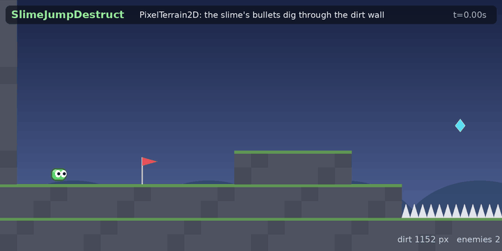

# SlimeJumpDestruct

[`SlimeJump`](../SlimeJump) with a destructible world. The slime, its level, the enemies, the traps and the bot that plays it are the same; what is new is a **wall of dirt that the slime's bullets dig through** and **crates that a bullet shatters into fragments**, with a blast that pushes things away, kills what it reaches and sets off the next crate. It uses three parts of the engine together:

| | |
|---|---|
| `PixelTerrain2D` (`Prowl.Core2D`, from `Prowl.Runtime/Destruction2D/PixelTerrain`) | the dirt wall: a bitmap with box colliders, dug by a stamp shape, rebuilt per chunk |
| `Shatter2D` (`Prowl.Core2D`, with `Fracturer` and `ExplodeOptions` from `Prowl.Runtime/Destruction2D/Shatter`) | breaks a crate into Voronoi fragments, and pushes everything near a point (`AddExplosionForce`) |
| Box2D-Packed, through the `pb2_*` shim | the crates and the fragments are ordinary rigid bodies; the blast, the bot's probes and the bullets use its overlap and ray queries |



The game is headless, like `SlimeJump`: a bot plays it and the program prints what happens. The picture above is drawn from that run's own state (the slime, the enemies, the crates, the dirt bitmap and the fragments' triangles), not by the engine's renderer.

## Run it

```sh
python3 build.py player Samples/SlimeJumpDestruct --run              # translate to C, build, run
python3 build.py player Samples/SlimeJumpDestruct --verify           # ... and compare with the .NET run
python3 build.py player Samples/SlimeJumpDestruct --verify --sanitize   # ... and run under AddressSanitizer and UBSan
python3 build.py player Samples/SlimeJumpDestruct --verify --wasm    # as WebAssembly under node (needs the wasm toolchain, see the main README)
```

The native player, the .NET run and the wasm module print the same 17 lines; the sanitizers report nothing. The game exits 0 when the slime wins, the dirt has been dug through, a crate has shattered and the scene is consistent (`scene.Validate()` finds no problems), and 1 otherwise.

```
t=0s x*1000=3500 y*1000=4575
t=1s x*1000=18419 y*1000=8389
t=2s x*1000=32401 y*1000=4374
boom step=297 crate=0 x*1000=36600 fragments=7 pushed=9 enemies hit=1 chained=0
t=3s x*1000=33619 y*1000=4374
boom step=351 crate=1 x*1000=44000 fragments=7 pushed=8 enemies hit=0 chained=1
boom step=363 crate=2 x*1000=45344 fragments=7 pushed=14 enemies hit=0 chained=0
t=4s x*1000=43184 y*1000=4374
boom step=411 crate=3 x*1000=52109 fragments=7 pushed=8 enemies hit=0 chained=0
t=5s x*1000=55550 y*1000=8017
t=6s x*1000=61463 y*1000=17277
won=1 frame=629 deaths=0 gems=1 enemies=2 slain=2 crumbled=0
first jump frame=57 first climb frame=481
max x*1000=61463 max y*1000=17588 end x*1000=61463 y*1000=15380
dirt 1152 -> 977 pixels (digs=4), crates=4 detonated=4 fragments=28 gone=21 enemies killed by blasts=1
tunnel through the dirt=1
scene problems=0
```

(Floats are printed as integers scaled by 1000: the C build's subset has no exact float printing. A step is 0.01 s, so the slime wins at 6.29 s.)

## What happens

1. **The slime walks to the dirt wall** (x 34 to 36, from the floor up 9 units: taller than a jump). The bot sees dirt within 2.6 units ahead on its row and stands still, shooting. Each bullet that hits a solid thing and finds dirt there digs a 1.5-unit hole (`Destruct.BulletHitsDirt`). Three bullets open a tunnel, and `PixelTerrain2D.Update()` rebuilds the chunks' native shapes so the slime can walk into it.
2. **A bullet through the tunnel hits crate 0**, which stands against the wall's far side (x 36.6). The bullet only *queues* the detonation; the next step it goes off (`Destruct.Detonate`): `Shatter2D.Explode` breaks it into 7 Voronoi fragments, `AddExplosionForce` pushes every body within 3.5 units, every enemy in that radius takes lethal damage (the worm dies), and because the blast reaches the dirt it digs a 2.5-unit crater that widens the tunnel.
3. **Crates 1 and 2 stand together** (x 44 and 45.3). The bot shoots the first; its blast puts the second on a 12-step fuse, so it goes off a moment later (a chain).
4. **Crate 3** (x 52) goes off as the slime passes. Then the slime climbs the wall, and shoots the bat on the way to the goal, as in `SlimeJump`.
5. **The fragments expire** after 2.5 s (`DebrisScript`), which gives their nodes, bodies, colliders and meshes back to the scene's pools: 21 of the 28 are gone when the run ends.

## What is different from SlimeJump

| File | |
|---|---|
| `Destruct.cs` (new, 255 lines) | everything destructive: the dirt terrain, the crates, the blast, the chain, `DebrisScript` |
| `Game.cs` | builds the dirt wall and four crates (`Destruct.Init`, `AddCrate`), calls `Destruct.Step` once per step before `Scripts.Tick`, prints the summary and sets the exit code |
| `Bot.cs` | also shoots a crate it can see within 9 units, and digs when dirt is ahead |
| `Enemy.cs` | `BulletScript`: a player bullet also targets crates (it queues the detonation), and one that hits a wall digs if the wall is dirt |
| `Layers.cs`, `Level.cs` | two layers, `Crate` (27) and `Debris` (28); `Level.LayerRows` makes them meet only the walls and each other |
| everything else | identical to `SlimeJump` |

Crates and fragments meet **only walls and each other**: the slime, the enemies, the bullets and the pickups pass through them, so the bot's route is the one it already knew, and a crate neither blocks it nor is pushed by it. The blast's `AddExplosionForce` does push every body in its radius, which includes the slime and the enemies if they are close.

## The numbers

| | |
|---|---|
| Dirt wall | 16 x 72 pixels at 8 pixels per unit (2 x 9 units), at (34, 4), in 1 x 2 chunks, box colliders, on the walls' physics layer (so bullets, the bot's probes and the enemies' sight treat it as a wall), friction 0 like the other walls |
| Dig | a bullet digs a circle of radius 6 pixels; a blast one of 10 |
| Crates | 1 x 1 unit, dynamic, at x 36.6, 44, 45.3 and 52 on the floor |
| Shatter | `Fracturer.Voronoi`, 3 extra points: 7 fragments per crate; fragments inherit the crate's velocity, density and friction |
| Blast | radius 3.5 units, force 60 (the step is 0.01 s, so it is a push of a few tenths of a unit per second for the step it lasts), lethal to either enemy kind, chain fuse 12 steps |
| Fragments | layer 28, expire after 2.5 s |

## Things worth knowing if you build on it

* **Nothing is destroyed inside a script's callback.** A bullet calls `Destruct.Queue`; `Destruct.Step`, which the game loop runs before the physics step, does the shattering and the digging. The scene cannot be changed under a script that is running.
* **A node is a slot of an arena.** When the crate is destroyed, its slot goes to the next node made, which is a fragment. A `Node` kept for a thing that has been destroyed then looks alive. The bot first shot at "crates" that were really fragments for exactly this reason; `Destruct.CrateLive` keeps its own *spent* mark and checks it before the node.
* **Pools are bounded** (`Prowl.Core2D/CoreLimits.cs`: 256 nodes, 512 components, 256 meshes). `Shatter2D.Explode` stops cleanly when one runs out and tells how many fragments it wanted (`Requested`); here 4 crates x 7 fragments fit easily, and `DebrisScript` returns them.
* **The C subset** (the C build refuses what it cannot translate; `python3 build.py check Samples/SlimeJumpDestruct` says what and where). Two things came up here: a list element cannot be passed straight into a call (`Scripts.AddDebrisScript(boom.Fragments[k])` has to go through a local), and a `?:` that produces a string is not allowed.
* **Not drawn.** The engine side of drawing is there (`Scene2D.CollectMeshes` gives the fragments' triangles, the sprite batch gives the crates), and `Samples/Draw2D` shows the renderer, but this game does not call it.

## Credits

The slime game is `Samples/SlimeJump` (ported from a Unity original, see its files). The terrain is a port of [DTerrain](https://github.com/crustos/DTerrain) (Dominik Zimny) and the shattering a port of [Unity-2D-Destruction](https://github.com/crustos/Unity-2D-Destruction) (Matthew Holtzem); the physics is [Box2D](https://github.com/crustos/box2d) (Erin Catto), through the crustos fork.
