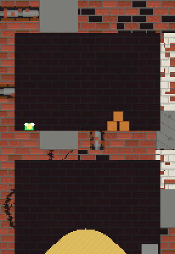

# SlimeJumpDestructSand

SlimeJumpDestruct turned sideways: the slime goes **down a shaft** (18 x 96 units, seven rooms) instead of scrolling right, and the shaft is full of things that break and things that flow.



The shaft is an old building falling apart. In the picture the walls are brick in 4-unit tiles of different kinds: plain brick, brick painted white and peeling, cracked brick, brick with bricks missing, bare concrete, and brick with an exposed pipe; behind the rooms is the same brick, dim. This is only how the picture is drawn (the terrain is still rock, sand and water pixels); it is drawn from the run's own state (the terrain bitmap and the colliders), not by the engine's renderer: `python3 tools/sand_gif.py` records the run and draws it.

- **Terrain**: one `PixelTerrain2D` with `EnableSand()`. Rock, sand and water are pixels of the same bitmap; stone and sand are ground, water is not.
- **Crates and boulders** (`Destruct.cs`): a boulder shatters with Shatter2D into rock fragments, digs a crater and sprinkles sand rubble; a crate digs a bigger crater, blasts, and sets off its neighbours.
- **Bullets dig**: a shot that hits rock or sand carves a hole, and the sand around it runs in.
- **Rooms**: 0 crates over the floor; 1 a sand dune that pours into any hole; 2 a pool in a basin that drains into room 3; 3 boulders and crates; 4 a sealed **sand silo**; 5 a sealed **water tank**; 6 the vault, with a **teleporter** that sends the slime back to the top (the shaft stays as it was left: the holes, the rubble and the sand are still there for the next trip down). Shoot a silo's plug and the contents run out and down.
- **Bot** (`Bot.cs`): drives the slime, so the headless run plays the whole level.

Run it: `python3 build.py player Samples/SlimeJumpDestructSand --run` (also `--verify` for .NET vs C, and `--sanitize`).
The run prints per-room "sand/water" grain counts as the slime enters each room, every explosion, and ends with `won=1`.

## In a browser

`python3 tools/build_sand_web.py` builds this game as a web page: C# translated to C, compiled to WebAssembly (clang, `wasm32-wasi`), drawn with WebGL2 (or WebGPU where the browser has it). The output is `Build/Player/SlimeJumpDestructSand-web/`:

```
index.html   prowl_web.js   prowl2d-player.wasm      (about 0.8 MB, 0.3 MB gzipped)
```

Put the three files in any folder of a static web server; there is no server code. The only thing the server must get right is the `.wasm` type (`application/wasm`), which Apache, nginx, Caddy and GitHub Pages all send. To try it here: `python3 -m http.server -d Build/Player/SlimeJumpDestructSand-web` and open `http://localhost:8000`.

The page starts as a demo, the bot playing the shaft (1x, 2x or 4x). **The first key, click or tap hands the slime to you**; `B` or the button hands it back. When the slime steps into the teleporter it is sent back to the top, with rings of sparks at both ends, and the lap counter goes up.

| | Desktop | Phone or tablet |
|---|---|---|
| Walk | `A` `D` or `←` `→` | the two arrow buttons |
| Jump | `W`, `↑` or `Space` | the jump button |
| Aim and shoot | the mouse, click to shoot | touch and hold anywhere on the picture |
| Dig straight down | `S` or `↓` | the dig button |
| Back to the start | `R` | |
| Bot or you, pause, full screen | `B`, `P`, `F` | the buttons under the picture |

**Full screen** (the button, or `F`) uses the browser's full screen where there is one, and fills the page where there is not (an iPhone). The picture keeps its 3:4 shape in the middle, and on a phone the touch buttons sit over the bars at its sides. Multi-touch works: one finger walking while another aims.

The headless game (`Game.cs`) and the page's game (`tools/sand_web/WebGame.cs`) share `World.cs`, which builds the scene and steps it, so the page plays exactly what the printed run plays: the same teleport at step 1366 and the same sand hash. The page's headless run (`python3 tools/build_sand_web.py --native`) also plays two laps, then sends it a key press, which must take the slime from the bot. The page's game is not in this folder because it draws, and a game that draws is built with the renderer.

Needs clang, lld, wasi-libc and node: `apt install clang lld wasi-libc libclang-rt-dev-wasm32 nodejs`.
